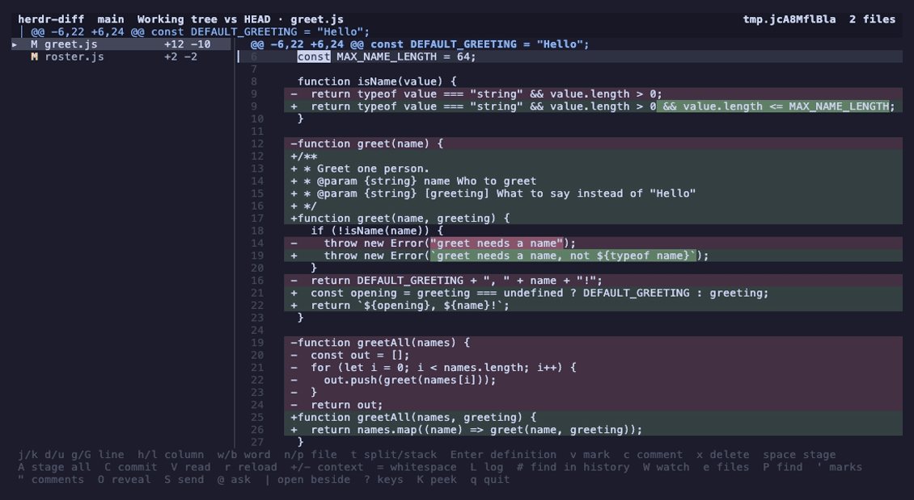

# herdr-deep-code-reading

Reading code closely, in a [Herdr](https://herdr.dev) pane.



Open a file, follow a name to where it is declared, list everywhere it is not, see what
the file reaches for and what reaches for it, and read who wrote each line and why. Ask
the agent in the next pane about the lines in front of you and read the answer beside
them. Read the repository's past the same way: the branch graph, any commit, any file's
history, any line's.

It reviews as well as it reads — a diff side by side, notes on the lines, the batch sent
to an agent as one message, then stage and commit — because reading a change and reading
the code it lands in are the same act.

**It changes the repository only through git**, and only through the few commands a
reader needs: `git add`, `git restore --staged`, `git commit`, and the fetch, pull and
push the log offers. **Nothing writes into a file of yours.** The browser copies, renames
and deletes whole files, which is what a reader does to a tree they are reading — but a
line of one is your editor's, and `E` hands the file over the way yazi does and steps
aside while you use it.

What it does write is its own: bookmarks, which files and commits you have read, where
the reading has been, and what an agent has answered, in JSON under the state directory
Herdr gives it. Nothing in there is your work, and deleting the lot costs you a list of
places. The one file that is yours is the one `X` writes, and it is written only when
you ask for it.

## Requirements

- Herdr 0.8.0 or later
- Node.js 18 or later
- git 2.24 or later, for everything that reads a history

No runtime dependencies and no build step. git computes the diffs; this plugin parses,
renders, and routes them.

## Install

```bash
herdr plugin install hiro960/herdr-deep-code-reading
```

`--ref` pins a tag or a branch, and `-y` skips the confirmation Herdr shows first:

```bash
herdr plugin install hiro960/herdr-deep-code-reading --ref main -y
```

Or, against a local checkout:

```bash
herdr plugin link /path/to/herdr-deep-code-reading
```

## Usage

Trigger an action from Herdr. The repository root is resolved from the calling pane's
working directory, so invoking it from a subdirectory works.

| Action | Shows | Equivalent |
|---|---|---|
| `herdr-deep-code-reading.review` | Working tree against HEAD | `git diff HEAD` |
| `herdr-deep-code-reading.staged` | Staged changes | `git diff --cached` |
| `herdr-deep-code-reading.branch` | Whole branch | `git diff <default-branch>...HEAD` |
| `herdr-deep-code-reading.files` | The file browser | — |
| `herdr-deep-code-reading.log` | The commit graph | `git log --all --graph` |

The default branch is resolved from `origin/HEAD`, falling back to `main` and then
`master`.

Bind a key in `~/.config/herdr/config.toml`:

```toml
[[keys.command]]
key = "prefix+alt+d"
type = "plugin_action"
command = "herdr-deep-code-reading.review"
description = "Diff: working tree vs HEAD"
```

`prefix` is Herdr's own prefix key, `ctrl+b` unless you have changed it. Herdr picks the
binding up on `herdr server reload-config`, or from `reload config` in its global menu.
From a shell, `herdr plugin action invoke review --plugin herdr-deep-code-reading`
does what the key does; it prints Herdr's own JSON record of the invocation on stdout.

## Keys

The footer always names every key the current view binds, so this table is a
reference rather than something to memorise.

### Everywhere

| Key | Action |
|---|---|
| `j` / `k`, `↓` / `↑` | Move one row |
| `d` / `u`, `PageDown` / `PageUp` | Half-page jump |
| `g` / `G` | First / last row |
| `K` | Show what this line was answered, or what the name under the cursor is |
| `e` | Switch between the diff and the file browser |
| `P` | Open a file by path, or `@name` to find a definition — except in the log, where it pushes |
| `L` | Open the log: the branch graph, and each commit's diff |
| `D` | Go back to the working tree's diff, whichever diff or view you are in |
| `#` | Find the commits where a string arrived, or went |
| `'` | List the places saved with `m`, and go to one |
| `"` | List every comment written so far |
| `&` | List every answer an agent has left |
| `J` | List what has been read, and go back to one |
| `X` | Write the session out as one markdown file |
| `M` | Open what a stopped merge could not settle — offered only while there is one |
| `W` | Watch the repository, reloading when it changes |
| `O` | Show what this view points at in the desktop's file manager |
| `\|` | Open this place in a second pane, beside this one |
| `@` | Write a question about these lines, to go with the next send |
| `S` | Choose which comments to send, and send them |
| `?` | List every key this view binds |
| `Q`, `Ctrl+C` | Quit |

The footer has four rows at most. When the list outgrows them the last row ends with
`… ? keys`, and `?` shows the whole of it one key to a row.

### While typing

A comment, a commit message, a filter, a query — they share one field at the foot of
the screen.

| Key | Action |
|---|---|
| `Enter` | Accept |
| `Esc` | Cancel |
| `Ctrl+D` | Start a new line, in a comment, a commit message, or a question |
| paste | Whatever was copied, newlines and all — the field stays open |
| `Ctrl+R` | Switch a search between literal text and a regular expression |
| `Ctrl+C` | Quit, half-written comment included |

`Q` is ordinary text while a field is open, so `Ctrl+C` is the way out from there.

**A paste keeps its newlines.** A terminal sends one as the characters it holds, and a
newline among them is the byte `Enter` sends — so a commit message pasted in three lines
used to be one line committed and two lines of keystrokes run against whatever came
next. The pane asks the terminal for bracketed paste, which wraps what arrives in
markers, and what is between them is text: it lands in the field whole, where the field
takes a line break, and with the breaks closed up in a filter or a query, which are one
line by nature. A paste with no field open does nothing at all — a pasted `D` in the
browser must not arm the delete it names.

**Quitting is `Q`, not `q`.** Unshifted it was the easiest key on the board to press by
accident — one tap, no question asked where nothing was unsent, and a session's reading
gone. `q` now does nothing at all rather than being given a new job: a key that quit
yesterday must not quietly do something else today.

### Diff

| Key | Action |
|---|---|
| `n` / `p` | Next / previous file |
| `t` | Switch between the split and stacked layouts |
| `h` / `l`, `←` / `→` | Move the cursor along the line |
| `w` / `b` | Step between the names on the line |
| `/` | Find text in this file's diff |
| `*` | Go to the next place the word under the cursor appears |
| `Enter` | Jump to where the name under the cursor is defined |
| `R` | List where that name is used instead |
| `v` | Start or drop a marked run of lines |
| `c` | Comment on the marked run, or on the line under the cursor |
| `x` | Delete the comment covering the line under the cursor |
| `+` / `-` | More, or less, of the file around each change |
| `=` | Stop counting whitespace as a change, or start again |
| `V` | Mark this file read, or unread |
| `space` | Stage or unstage the selected file (`review` mode) |
| `A` | Stage every change, untracked included (`review` mode) |
| `C` | Write a commit message and commit what is staged (`review` mode) |
| `D` | Load the working tree's diff instead of this one (every mode but `review`) |
| `r` | Reload |

The file list is in path order, whatever state each file is in. Untracked files used to
be appended after everything `git diff HEAD` reported, which put a new file at the bottom
until it was staged and then moved it into path order — carrying the selection with it,
because a reload follows a file by its path. Nothing a reader stages moves now, so
`space` and `n` walk the list once.

**`j`/`k` always move the cursor down the lines and `n`/`p` always move the file
list.** Neither takes a turn at being the other, and there is no focus to move
between them. The log is the other way round — four panes and a `Tab` that cycles them
— so `Tab` pressed here, where it would have nowhere to go, says what moves the file
list instead of doing nothing at all.

Staging follows `git status`, which only lines up with `review` mode's file list, so
the `staged` and `branch` modes leave those three keys unbound. `D` is what they offer
in their place: it loads `git diff HEAD` into the same pane, with the staging keys back,
and `Ctrl+O` returns to the diff it was pressed from. `r` is not that key — it reloads
whichever diff is already on screen and never changes which one that is.

### File browser

| Key | Action |
|---|---|
| `l`, `Enter` | Step into a directory, or open the file |
| `h`, `Esc` | Step out to the parent |
| `f` | Filter the listing by file name |
| `a` | Make a new empty file, under this directory |
| `y` | Remember this file, for `p` to write elsewhere |
| `p` | Write the remembered file here, under its own name |
| `D` | Delete this file — asks first |
| `r` | Rename this file |
| `/` | Search inside the files (`Ctrl+R` for a regular expression) |
| `Tab` | Show the selection's contents or its own diff |

In a repository the listing comes from `git ls-files`, so `.git` and everything
`.gitignore` names are absent without a filesystem walk. Files over 2MB, and files with
a NUL byte in their first 8KB, are listed but not read.

**`y`, `p`, `D` and `r` move whole files about.** They are yazi's keys for the same
four things, less the one that would cost you something: `y` remembers the file under
the cursor and `p` writes it into the directory you have walked to, under its own name;
`r` renames, with the old name already in the field; `D` deletes, and names what is
about to go and waits for the same key again, the way the pull and the push do. `d` is
not the delete key — it pages the listing here as it does everywhere else, and a reader
meaning to scroll must not lose a file for it. `D` is therefore the one letter the
browser needed for something of its own: `e` opens the diff and `D` is waiting there,
so the way back to the working tree is two keys in this one view.

Nothing is ever overwritten. A destination something already answers to is refused
rather than replaced, and all four act on a file and never on a directory. A delete is a
delete: the file is gone rather than in a wastebasket, which is why it asks.

**`a` makes a file.** Name it and it exists, empty, under the directory being browsed —
yazi's key for the same thing. What goes in it is `E`'s business, so the new file opens
in the reader with the editor one keystroke away, and the browser behind it is left
standing on it. A name with directories in it makes them: a directory with nothing in it
never appears in this listing, so "go there first" would be advice you could not take.

It refuses a name something already answers to, a name that climbs out of the repository
with `..`, and a name that leaves through a symlinked directory — git tracks symlinks, so
`elsewhere/notes.md` can be outside the repository with nothing about the name to say so.
Nothing is ever written into the file: this is `touch`, and the editor is still yours.

### Reading a file

`v`, `c`, `x` and `S` work here exactly as they do on a diff, so any line of any file
can be a note to the agent — not only the lines that changed.

| Key | Action |
|---|---|
| `h` / `l`, `w` / `b` | Move along the line, or between its names |
| `/` | Find text in this file |
| `n` / `N` | Next / previous match |
| `*` | Go to the next place the word under the cursor appears |
| `Enter` | Jump to where the name under the cursor is defined |
| `R` | List where that name is used instead |
| `o` | List what this file defines (headings, in a markdown document) |
| `i` | List what it imports, and what imports it |
| `H` | List this file's commits, or the marked lines' |
| `B` | Show which commit each line came from |
| `C` | Open the commit this line came from — offered only while `B` is on |
| `E` | Open the file in your own editor, at this line |
| `m` | Save this line as a place to come back to, or unsave it |
| `]` / `[` | Next / previous conflict — only in a file a merge could not settle |
| `Esc`, `Ctrl+O` | Back to wherever the file was opened from |

Result lists — search hits, an outline, imports, commits, bookmarks, quick open — all
move with `j`/`k`, open with `Enter`, and come back with `Esc` or `Ctrl+O`.

`Enter` goes to where a name is declared and `R` lists everywhere it is not — the calls,
the imports, the mentions. A plain search answers with both at once, and the definition
is one row in the middle of a hundred calls.

The definition jump, the uses list and the outline are `git grep` plus patterns rather
than a parsed index, so they will miss a definition written unusually — and `R` will
answer for any other name spelled the same way. These have patterns of their own:

| | |
|---|---|
| Curly-brace | JavaScript, TypeScript, Dart, Java, Kotlin, C#, Swift, C, C++, Go, Rust, PHP |
| Otherwise | Python, Ruby, Lua, shell, SQL |
| Not a program | Markdown, HTML, CSS (with Sass and Less), Vue, TOML, YAML |

A file in any other language still gets its comments, strings and numbers coloured, but
has no outline to list — and `o` says so in those words rather than reporting that the
file declares nothing.

Three of them are read the way the language is written rather than the way a parser
would. SQL is asked without case and past whatever whitespace opens the line, because a
script shouts `CREATE TABLE` and indents where it likes. A stylesheet is named by its
whole selector: `.card` and `.card > .title` are two rules, and calling both `.card`
helps nobody. A Vue component is a template, a script and a style block in one file, and
a line at a time cannot change language halfway down — so the three blocks are
themselves what it declares, the script is read as JavaScript throughout, and the
template's `<!-- -->` goes uncoloured.

Search is literal by default, because a reader looking for `a.js` or `foo(1)` means
those characters. `Ctrl+R` in the search field switches it to an extended regular
expression and back, and the field says which one it is in. The choice is remembered
for the next search.

## A directory that is not a repository

Most of what this does is reading, and reading wants a file rather than a history. So a
directory git has never heard of opens on the browser, and what it can show it shows:
the files, any one of them read, its outline, `/` through it, `P` to another by name,
`Enter` to where a name is declared and `R` to everywhere it is not, bookmarks, the
reading record, and every question `@` asks an agent with the answer coming back beside
the line. Nothing here needs a repository, and nothing here asked for one.

The listing is walked instead of asked for, under rules short enough to hold in your
head: `.git` is never source at any depth, a symlink to a directory is not followed —
one loop and a walk never ends — and the walk stops at twenty thousand files and says
that it stopped. Nothing else is skipped by name: a directory really does contain its
build output, and a listing that quietly decided otherwise would be answering a question
nobody asked. A tree with a large `node_modules` in it will meet the ceiling and be told
so.

Searching is the same trade. `git grep` answers for a repository; here the walked files
are read and matched in this process, which is slower and finds the same lines. A
pattern is read by JavaScript rather than as git's extended regular expression, and the
two part company at the edges — `\d` among them.

What is withheld is what would read a history: the three diffs, the log, `H`, `B`, `#`,
staging, and the remote. The footer does not name them, which is the promise it makes
everywhere else, and pressing one out of habit says `No repository here — that key reads
a history` rather than failing at git.

`W` still watches, because the file an agent writes its answers into is not in the
repository anyway — which is the half of the watch that matters most here.

## Looking through what is on screen

`/` finds text in the file being read and in the diff of the file being reviewed. It is
the same search in both, of the rows in front of you rather than of the repository —
`/` in the browser and `#` are the two that look further.

`*` is vi's, and it is what the diff has instead of `n`. The file list owns `n` and `p`
there and never takes a turn at being anything else, so a search with no way to repeat
it would be half a search. `*` needs no second key: it looks for the word under the
cursor, the jump lands on another spelling of that same word, and the next press carries
on from there. At the end of the file it wraps and says so. In the reading view `n` and
`N` still walk a search both ways, and `*` starts one without typing it.

## Reading a diff

Three things narrow a diff down to what actually changed.

**The words, not the lines.** A line-oriented diff says "this line is different" and
nothing more: a renamed variable and a rewritten expression are the same shade of red.
The words that actually changed are picked out inside the line, by walking in from both
ends until the two stop agreeing — git's own `contrib/diff-highlight` does this and its
virtue is that it never claims a word changed when it did not. A line rewritten end to
end is left alone, because highlighting nine tenths of it says nothing the colour has
not already said.

**More of the file, or less.** `+` and `-` move up and down a ladder — no context,
three lines, six, twelve, twenty-five, fifty, the whole file. Three is git's own
default and often exactly one line short of the thing that explains the change.

**Whitespace, or not.** `=` turns on git's `-w`, and a commit that moved a block one
level in stops being a wall of red and green with a handful of real edits inside it.

Both of the last two are named in the header while they are set. A diff that is hiding
every whitespace change is not one to be left holding without knowing.

## The row you are on

Deep reading is mostly a matter of not losing your place, so the row under the cursor is
drawn as a band of colour across its whole width — the gutter, the line number, the
blame column and the text.

A terminal cannot do more than that. Every cell is one size, so no line can be made
taller or set in a larger face; the VT100 double-height attribute is the nearest thing
there is, and Herdr's own grid does not carry it. It would be the wrong answer anyway: a
row twice as tall pushes everything below it down a line, so every `j` would make the
screen jump. Colour costs no rows and moves nothing.

An added or removed line keeps its own colour under the band, lifted rather than painted
over — the background is what says which of the two it is. Syntax colouring survives it,
and so does the word cursor. `cursorline = false` turns it off.

## What you are inside

One row under the header holds the thing the cursor is inside: the enclosing function
when a file is being read, and the hunk heading — which git writes the function name
into — when a diff is. It is the piece of context a reader loses first and misses most,
because a function long enough to need reading carefully is a function long enough that
its own name has gone off the top by the time you are in the middle of it.

The enclosing thing is found by walking up from the cursor to the nearest line that
declares something at a shallower indent. The function *before* the one being read is a
sibling, not a parent, and naming it would be worse than naming nothing.

`K` answers the other half of the question. It shows what the name under the cursor
*is* — twelve lines of its definition, in place of the body — without going there.
`Enter` is the key that goes there and gives up your place; this is the one that does
not. The next key, any key, puts it away — and `Esc` is spent doing only that, so
dismissing a glance never costs you the place it was taken from.

`|` is the same idea taken further: it opens a second pane of this plugin beside this
one, at the place under the cursor, so a definition and its caller can be read side by
side. Herdr is a terminal multiplexer, and this is one call to it.

## Editing

`E` in the reading view hands the file to your own editor, at the line under the
cursor. This is yazi's arrangement, and for the same reason: the pane draws the file
itself but has no editor of its own, so it hides to a secondary screen, gives the
terminal to `$VISUAL` or `$EDITOR` — `vi` when neither is set — and waits.

Coming back reloads both the file and the diff, and puts you back on the line you left
from. The plugin still writes no content itself: the editor is yours, launched by your
keystroke, writing under your hands. The one file it creates it creates empty — `a` in
the browser, at a name you typed — so that this key has something to open.

An editor set with arguments is honoured, which is how a windowed one is made to wait:

```sh
export EDITOR='code -w'
```

`editor` in the config file comes before `$VISUAL` and `$EDITOR`, which is where to name
one for this pane alone — a reader whose `$EDITOR` is a line editor has somewhere to say
so that does not follow them into every other program.

The line is passed the way each editor wants it — `+N` for vi, vim, nvim, nano, emacs,
kak and micro; `path:N` for helix, sublime and zed; `--goto` for the VS Code family.
An editor on none of those lists is given the file and opens it at the top.

## Bookmarks

`m` saves the line under the cursor; `m` on a saved line takes it away. `'` lists what
is saved, from any view, and `Enter` goes there.

They outlive the pane. The store is one JSON file under `$HERDR_PLUGIN_STATE_DIR`,
keyed by repository, so several repositories share it without colliding.

A bookmark records the line's own text as well as its number, the way a comment does.
Numbers rot as soon as anything above them is edited, so the number is where the jump
starts looking and the text is what it looks for — a file that has grown a header
since sends you to the line, not to line 42 of something else.

## What you have read

`V` marks the file the panel points at as read, and marks it unread again on a second
press. A review of forty files is not one sitting, and coming back to one without this
means starting at the top and recognising your way down.

A mark records *what* was read, not only that something was. The file's own diff is
hashed and the hash kept beside the path, so an agent that touches a file after you
marked it read makes it unread again. A read file recedes rather than disappearing: its
row dims and the mark takes the place of the line counts, which are a measure of how
much there is left to read. The header counts them.

They outlive the pane, in a JSON file under `$HERDR_PLUGIN_STATE_DIR` keyed by
repository, the way the bookmarks do. Marks for paths a rebased branch no longer has
are dropped whenever one is set.

## Where the reading has been

`Ctrl+O` is the way back and forgets as it goes; the bookmarks are the places you chose
to keep. Neither answers the question a reading spread over a week opens with — what did
I read last time, and in what order.

`J` does. Every file opened from the browser or named by path with `P`, and every
commit opened from the log or a history list, goes on a record kept per repository, and
`J` lists it oldest first with `Enter` to go back to one. Yesterday's reading is usually
where today's starts.

Only the deliberate opens are on it. Stepping the graph loads a commit, following a name
loads a file, and `P @name` goes to a definition rather than to a file — none of them is
a thing you decided to read — a record of every jump
is a record nobody reads back. The same place twice in a row is one entry; the same place
come back to after reading something else is two, because that is you going back to check
something.

It is a JSON file under `$HERDR_PLUGIN_STATE_DIR` keyed by repository, written as each
place is opened, holding the last thousand.

**`X` writes the session out.** One markdown file — the commits opened and which were
read through, the files opened, every question with whatever came back to the line it
was asked about, and the comments as they were written. It lands beside the stores as
`reading-<repo>-<date>.md` and is the one thing here that leaves with you.

A section with nothing in it is left out. Comments and questions live for the session,
so writing out is an end-of-sitting act: the commits and files come from the record and
will still be there tomorrow, and what you asked today will not.

## Watching

`W` turns on a poll of the repository, and the header says `watching` while it is on.
When anything changes — an agent editing a file in another pane, a commit landing, a
stage — the pane reloads itself and keeps you where you were.

It polls rather than watching the filesystem, because `fs.watch`'s recursive mode is
not available on Linux under Node 18. A tick is two short git commands, a `stat` per
changed file, and one more `stat` of the notes file — which is not in the repository at
all, and is the reason an agent's answer arrives without `r` being pressed. A reload
waits for a half-written comment or an open picker: the change keeps, and arrives once
the field is closed.

## The log

`L`, from anywhere, opens the repository's shape: which branches there are, where each
one left the trunk, and where it came back.

```
┌ branches ──┬─ graph ─────────────────────────────────────────────┐
│ ▸ main  ↓3 │ *   1cea1c6 (main) (origin/main) docs: describe …   │
│   feat/x ↑2│ |\                                                  │
│ ─ remotes  │ | * a73007c (feat/x) feat(history): read any commit │
│   origin/… │ * | 6368f31 feat(watch): reload the pane …          │
├────────────┴──────────────┬──────────────────────────────────────┤
│  M  lib/app-state.js  +12 │  21    reloaded,                     │
│  A  lib/editor.js     +48 │  22  + reloadedInPlace,              │
└───────────────────────────┴──────────────────────────────────────┘
```

Four panes. `Tab` goes round them: the graph, the files of the commit it is on, the
diff of one of those, and the branch list. Movement follows the focus, so `j` and `k`
mean "next commit", "next file" or "next line" depending on where you are.

| Key | Does |
|---|---|
| `j` / `k`, `d` / `u`, `g` / `G` | Move in whichever pane has the focus |
| `Tab` | Next pane |
| `Enter` | On a branch, narrow the graph to it; anywhere else, open the commit |
| `a` | Swap between every branch and the one you are on |
| `f` | Follow the trunk: a merge is one row, not the branch it brought in |
| `A` | Narrow the graph to one author, or to everybody again |
| `V` | Mark this commit read, or unread |
| `r` | Read the graph again |
| `F` | Ask every remote what it has, and prune what it no longer has |
| `p` | Pull what has arrived onto the branch you are on — asks first |
| `P` | Push this branch's own commits out — asks first |
| `v`, `c`, `x` | Mark, comment, delete — on the diff under the graph |
| `Esc`, `Ctrl+O` | Back to wherever the log was opened from |

git draws the graph. `git log --all --graph` has solved lane allocation, crossings and
merge edges for twenty years, and the lanes it draws are read back and coloured one
colour per lane rather than recomputed here. The cursor never lands on the `|\` and
`|/` rows: they belong to no commit, so `j` steps past them to the next one that has a
diff to show.

Moving in the graph loads the commit under the cursor into the two panes below. A merge
is diffed against its first parent — asked for a merge on its own git prints nothing at
all, which would tell you a merge changed nothing.

**The trunk, one merge at a time.** `f` reads the graph with git's `--first-parent`, so
a merge is one row and the commits that arrived through it are not listed beside it.
Narrowed to one branch with `a`, that is the list of what landed in the order it landed
— the shape somebody else's work has when you are reading through it rather than
looking for one thing. The header says `first-parent` for as long as it is on, and the
choice survives a reload and a move to another branch. Every branch at once keeps its
own meaning: `--all` follows the first parent of each of them, so a branch tip is still
drawn from its own end.

**Whose work it is.** `A` narrows the graph to one author, opening with the author of
the commit under the cursor already in the field — a reader asking whose this is is
looking at a commit of theirs. An empty field gives everybody back. git matches the
name against both the name and the address a commit carries, and matches loosely, so
half a surname usually finds them. The header names them for as long as one is chosen.

The three keys are one question asked three ways, and together they are what following
somebody's work looks like: `a` for which branch, `f` for what landed on it, `A` for
who landed it.

**What you have already read.** `V` marks the commit the graph is on, and unmarks it on
a second press — the same key the diff view marks a file with, asked one size up. A read
commit dims and carries `✓` at its left, and the header counts them, so a graph reads
`12/40 read` rather than `40`. Forty commits landed this week and finding out which
eleven you have been through is otherwise reading them again.

The mark is the sha and nothing else. A file's mark has to record what the file looked
like when it was read, because the working tree moves under it; a commit cannot change,
so there is nothing here to go stale and nothing to prune. They outlive the pane, in a
JSON file under `$HERDR_PLUGIN_STATE_DIR` keyed by repository, the way the bookmarks
and the file marks do.

**What has arrived, and what has not.** Each local branch carries how far it has drifted
from the branch it follows: `↓3` is three commits waiting, `↑2` is two of yours that
have not gone out, `↑2↓3` is both, and `gone` is an upstream someone deleted at the
other end. The counts are green when there is something to take and dim when there is
not, so a column of branches says at a glance which of them have news on them.

They are read from the copy under `refs/remotes`, which only a fetch updates — so the
header dates them: `main ↓3  fetched 20m ago`, or `never fetched`. A number without its
age would read as news when it is a memory.

`F` is how the question is asked again. It runs `git fetch --all --prune`: every remote
is asked what it has, the copies are updated, and a branch deleted at the other end
stops being listed here. Nothing local moves — no branch, no index, no file — so it
needs no confirmation, and the footer says where you now stand: `Fetched — main is 3
behind origin/main`.

**`p` pulls, and asks first.** The branch is the one you are checked out on, and the
first press names it before anything happens: `Pull main from origin/main ↓3 — press p
again`, or `↑2↓3 as a merge` when both ends have moved. Any other key takes the prompt
back off. It is the one key here that changes the files under you, and two presses is
what that is worth.

`git -c pull.rebase=false -c pull.ff=true pull --no-edit` is what runs. Both settings are
pinned rather than left to your config: a configured rebase would rewrite your own
commits rather than merge them, and `pull.ff=only` would refuse the merge outright. What
it cannot settle on its own becomes a list — see below.

**`P` pushes, and asks first too.** `p` and `P` are one word in its two directions, which
is why this is one of the two keys in the pane that mean something else here than they do
everywhere else — `C` is the other, and reads a commit where a diff writes one. In the
log it sends, and in every other view it still finds a file by path. Only the log's
footer says `P push`, and nothing leaves until it is pressed twice.

The first press says what is going and where: `Push 2 commits from main to origin/main`,
or `Push feat/x to origin and follow it` for a branch nobody has seen yet — which is
`--set-upstream`, so the next push has somewhere to go on its own. The refspec is written
out in full rather than left to `git push` and whatever `push.default` says, because
`matching` is still in some people's config and would send every branch whose name the
remote also has.

Refused before the network: a detached HEAD, a branch with nothing of its own to send, a
branch that has diverged — `main and origin/main have diverged (2 here, 3 there) — pull
it first`, because what is over there is somebody else's — and a branch whose repository
has several remotes and no `origin` to pick. **Nothing here forces.** A push git rejects
is one that would drop work somebody else pushed, and the answer to it is `p` and a look
at what arrived. There is no `--force`, no `--force-with-lease`, and no key that adds one.

All three keys run with `GIT_TERMINAL_PROMPT=0` and in a session of their own, so nothing
can stop to ask for a password on a terminal that is drawing something else; a fetch that
cannot authenticate fails and says so rather than hanging. All three are bounded at two
minutes. The pane is still while any of them runs, the way it is still while your editor
has the screen.

Up to 500 commits are read. A terminal under 120 columns drops the branch list; one too
short for two halves gives the whole body to the graph, and `Enter` still opens a
commit in the whole pane.

## When a merge stops

git settles most of a merge on its own. What it cannot settle it leaves in the files,
both versions between markers, and stops — and `p` puts you in front of the list of it:

```
┌ conflicts  (1/2 resolved) ──────────────────────────────────────┐
│ a.txt        ✓ both modified                                    │
│ b.txt        deleted by them                                    │
└─────────────────────────────────────────────────────────────────┘
```

Every screen says so while it lasts. The header carries `main (merging — 1 left)`
wherever you are, and `M` opens the list from anywhere — a half-merged working tree is
the one thing here you must not walk away from without knowing.

| Key | Does |
|---|---|
| `Enter` | Open the file, at its first conflict |
| `o` | Take our side of it, whole |
| `t` | Take their side of it, whole |
| `space` | Say a file you edited by hand is finished |
| `E` | Hand it to your own editor, at the conflict |
| `C` | Commit the merge, with the message git wrote |
| `!` | Undo the whole merge — asks twice |
| `M` | Open this list, from any other screen |

**The file itself.** `Enter` opens it in the reader, with the two versions drawn apart:
our side on one background, theirs on another, and git's markers in the colour a hunk
header takes — they are git talking in the middle of your code, not code. `]` and `[`
step between conflicts, which is what a file with four of them needs. The colours are
two hues of their own rather than the diff's green and red: nothing here was added or
removed, both versions exist, and you are choosing.

```
     1    one
     2  <<<<<<< HEAD
     3  ours                    ← blue
     4  =======
     5  theirs                  ← violet
     6  >>>>>>> origin/main
     7  three
```

**How it is settled.** `o` and `t` are `git checkout --ours`/`--theirs` and a `git add`
— or a `git rm`, where the side you chose is the one that deleted the file, which the
status letters say and git's error message does not have to. Anything finer is your
editor's: `E` hands the file over and takes the screen back when it exits, and `space`
records that it is done. There is no key that takes half of one side, because that would
mean writing a file neither side wrote, and this pane does not write files.

`C` commits with the message git already wrote for the merge. It refuses while anything
is unresolved, and asks twice when a file you marked resolved still has `<<<<<<<` in it
— said rather than refused, because that is a line some files carry for their own
reasons and the decision is yours. `!` undoes the whole thing, including every side
already chosen, so it asks twice as well.

Only a merge. A rebase and a cherry-pick stop the same way and leave their own state
behind, and neither is something this pane can start — so neither is something it claims
to be in the middle of.

## One file's history

The log answers "what shape is this repository in". These answer the narrower question.

| Key | Where | Shows |
|---|---|---|
| `H` | reading a file | The commits that touched this file |
| `v` then `H` | reading a file | The commits that touched the marked lines |
| `B` | reading a file | Which commit each line came from |
| `#` | anywhere | The commits where a string arrived, or went |

These are flat lists rather than graphs: a graph is a fact about the repository, and
these are about one file. A commit opens in the pane the working-tree diff was in, with
the staging keys withheld — `git add` has nothing to say about a commit that has
already landed. `Ctrl+O` brings the previous diff back.

`H` on a marked run is `git log -L`, and it is the more complete answer to the
question `B` asks: every commit that moved those lines rather than only the last one.
`B` is the other shape of it — the whole file at once. The column it adds is taken out
of the width the lines are wrapped to, so turning it on rewraps the file.

`C` opens the commit the column names for the line under the cursor. A sha and a date
are half an answer; the rest is in the commit, and `H` lists the whole file's rather
than the one line's. It is offered only while the column is on, because the column is
what the reader is pointing at — and it is the second key in the pane, after `P`, that
means something other than what it means elsewhere: in a diff `C` writes a commit, and
here it reads one.

`#` asks the third question, and on unfamiliar code usually the first one worth asking:
where did this come from. It opens with the word under the cursor already in it and
runs git's pickaxe — the commits where the number of times the string appears *changed*,
which is deliberately not the same as the ones that mention it. A commit that only moved
the line is passed over. `Ctrl+R` reads the query as a pattern instead, and asking while
reading a file narrows it to that file.

## Comments

A comment records the file, the side (`new` for added and context lines, `old` for
purely removed ones), the line range, and the verbatim lines it points at. Those lines
are the anchor: line numbers are never re-bound when the diff shifts, so a comment
still says what it was written against.

`"` lists every comment written so far: `Enter` goes to one, `x` takes one away from
where you can see what you are removing.

`S` opens the same list with everything chosen, `space` leaves one out, and `Enter`
sends what is left as one markdown message:

````markdown
Code review: 1 comment. Please address each one.

### src/a.js:2 (new side)

```diff
-  return "Hello, " + name;
+  return `Hello, ${name}!`;
```

Template literal is fine, but check the callers.
````

Any Herdr pane in the workspace carrying an agent is a candidate. One agent receives
the batch directly; several open a picker; none writes it to
`$HERDR_PLUGIN_STATE_DIR/review-comments.md` and reports the path.

**The batch is pasted into the agent's input and never submitted.** You read it, edit
it, and press Enter yourself. The comments stay in the review pane afterwards.

Comments live for the session, and so do the questions `@` writes. `Q` with either
unsent asks before discarding them, and an unexpected error writes what you had to
`$HERDR_PLUGIN_STATE_DIR/review-comments-crash.md` before exiting.

## Asking

`S` sends one way: here is my review, do something about it. `@` is the other
direction, and for reading unfamiliar code it is the one that matters more.

It opens a field over the line or the marked run, and the question goes on the same list
the comments are on. `S` sends the lot as one message — the comments as things to change,
the questions as things to answer and change nothing about — so a page with five things
you do not understand in it is one trip through the agent's pane rather than five. A
question is marked `?` in that list, and `space` leaves one out the way it does a comment.

Each question carries the exact command to answer it with, one per question, because
`bin/note.js` writes one note per run. The command is spelled out in full — every path
absolute, nothing discovered — because the agent's shell is not a plugin process and has
none of the plugin's environment.

```sh
node /path/to/herdr-deep-code-reading/bin/note.js \
  --store /path/to/state/notes.json --repo /path/to/repo \
  --file lib/greet.js --line 12 --from you  it runs once per name
```

An answer lands beside the line it is about, marked in the gutter with `◆` rather than
a comment's `●`. **Sending a batch with a question in it turns the watch on**, so the
answer appears on its own: the notes file is one of the things the watch fingerprints,
and having just asked is the moment you most want to be told. `@` alone does not — the
question is on a list until `S` sends it, and nothing can answer a question that has not
gone anywhere yet.

`W` catches up before it starts watching, so an answer written while the watch was off
is on screen the moment it is turned on rather than waiting for the next unrelated
change.

`K` on a marked line reads the answer out, in place of the body, the way it shows a
definition on any other line — an answer is what you want to see on a line that has one,
and the definition is still where `Enter` goes. `&` lists every answer there is: where
each one is, its first line, and who wrote it. `Enter` goes to one and `K` there reads
the whole of it.

Anything that can run one command can leave a note — `bin/note.js` needs no quoting
around the text, which is the part of a shell command a language model gets right least
reliably. An answer worth several lines is written with `-` in place of the text and the
lines piped in, which the question spells out as well; an answer longer than four
thousand characters is cut rather than refused, because a note nobody sees is worse than
one that ends in an ellipsis. `--clear` takes them all away.

## Terminal width

The review pane opens zoomed, because two columns need roughly 160 of them. Narrower
terminals degrade automatically:

| Columns | Layout |
|---|---|
| 160+ | File panel and side-by-side diff |
| 100–159 | File panel and unified diff |
| Up to 99 | Unified diff only |

The log divides the same width again: 120 columns and up carry the branch list beside
the graph, and narrower terminals give the whole of it to the graph.

`t` overrules the width and the choice is remembered, so a later resize follows it; the
config file's `layout` is the same choice, made before the pane opens.
Deleted lines are kept in every layout, and long lines wrap rather than being cut —
measured in terminal cells, so full-width text breaks in the right place.

## Configuration

Herdr gives every plugin a directory to be configured from. `config.toml` there is read
when a pane opens:

```bash
herdr plugin config-dir herdr-deep-code-reading   # prints where to put it
```

```toml
theme      = "catppuccin-latte"   # one of the four palettes below
layout     = "stacked"            # "split" or "stacked"; omitted, the width decides
editor     = "nvim"               # what E hands the file to, before $VISUAL and $EDITOR
cursorline = false                # stop drawing a band across the row you are on
worddiff   = false                # stop picking out the words that changed in a line
```

The file is read as a flat list of `key = value` lines — no tables, no arrays, no
escapes. A line that is not one of those is passed over, and a value nothing recognises
falls back rather than failing: a mistyped colour scheme is not a reason to refuse to
show a diff.

The environment overrules the file, so a variable set for one invocation still does what
it says:

| Variable | Purpose |
|---|---|
| `HERDR_DEEP_CODE_READING_REPO` | The directory to read (defaults to the working directory) |
| `HERDR_DEEP_CODE_READING_MODE` | `review`, `staged`, `branch`, `files`, or `log` (defaults to `review`) |
| `HERDR_DEEP_CODE_READING_THEME` | The palette, as `theme` above |
| `HERDR_DEEP_CODE_READING_LAYOUT` | The diff layout, as `layout` above |
| `HERDR_DEEP_CODE_READING_EDITOR` | The editor, as `editor` above |
| `HERDR_DEEP_CODE_READING_CURSORLINE` | `false` turns the band off |
| `HERDR_DEEP_CODE_READING_WORDDIFF` | `false` turns the word highlighting off |
| `HERDR_DEEP_CODE_READING_OPEN` | `path:line` to open on, which is how `\|` tells a new pane where to go |

### Palettes

| Name | Written in | For |
|---|---|---|
| `catppuccin-mocha` | hex | dark terminals that can draw a colour exactly |
| `classic` | 256-colour indices | dark terminals, everywhere |
| `catppuccin-latte` | hex | light terminals that can draw a colour exactly |
| `classic-light` | 256-colour indices | light terminals, everywhere |

A palette written in hex keeps its hues; one written in indices lets a user's own
terminal theme have a say. Without a name, `COLORTERM=truecolor` picks
`catppuccin-mocha` and anything else picks `classic`.

**A light palette is never chosen for you.** Nothing a terminal reports says whether its
background is light, and guessing wrong is the one mistake that makes a diff unreadable
rather than ugly — so `catppuccin-latte` and `classic-light` answer to their name and to
nothing else.

## Development

```bash
npm test          # every test; nothing to install first
npm run coverage  # the same tests, with a coverage floor the run fails below
npm run lint      # ESLint; the only thing that needs `npm install`
```

The plugin itself runs on Node 18. ESLint does not — it wants Node 20 or later — so
linting is the one task with a higher floor than the code it checks.

The floor is 96% of lines, 90% of branches and 96% of functions — a line not to fall
below rather than the number the suite is at. CI runs it on Linux and macOS across Node
18, 20 and 22, plus coverage and lint once each. `package.json` and `herdr-plugin.toml`
both carry the version, and a test fails if they disagree.

## Scope

Not offered, deliberately: hunk-level staging and hunk-level conflict resolution,
force-push of any kind, amend, revert, discard, checkout, branch, rebase, cherry-pick,
stash, anything at all done to a directory rather than to a file, mouse support, comment
persistence across sessions, and Windows — the plugin declares macOS and Linux.

The log is where the line runs, and the three keys that cross it say where it is. A
fetch moves nothing: it asks what has arrived, which is a question a reader is asking
anyway and cannot answer by looking. A pull takes what has arrived onto the branch
already checked out, and a merge is where a pull ends — including the merge that stops,
which is why there is a screen for that. A push sends this branch's own commits to the
branch it already follows, and only when the other end can take them without losing
anything: a rejected push is a push that would drop somebody else's work, and the answer
to that is to pull and read what arrived. Past those, the repository is written through
`git add`, `git restore --staged` and `git commit` and through nothing else.

What is on the other side of the line is everything that rewrites what you came here to
read, and everything the pane cannot draw. A rebase rewrites your own commits and stops
in a state with no list to show. Choosing half of one side of a conflict means writing a
file neither side wrote — your editor's job, and `E` is how it gets it. Reading a
repository and rearranging one are still different jobs, and this is still a tool for
the first.

The same line decides what the browser's file keys do. `a` makes a file and makes it
empty; `y`, `p`, `D` and `r` move whole files about. What none of them does is write
into one: a line of a file, a word of it, is the editor's, and `E` is a keystroke away.
Naming a file, copying it, dropping it and calling it something else are what a reader
does to the tree in front of them, and leaving the pane to do them is leaving the pane.
Where the line still runs is at the directory: these four act on a file and never on a
directory, because the listing is built from files and a recursive delete is the widest
blast radius there is for the narrowest gain.

## License

MIT
